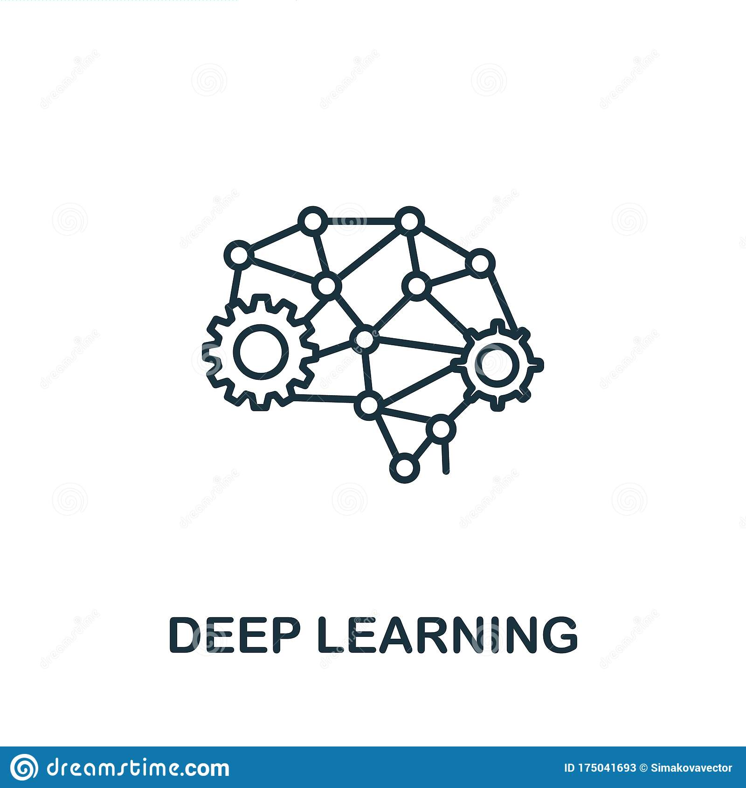
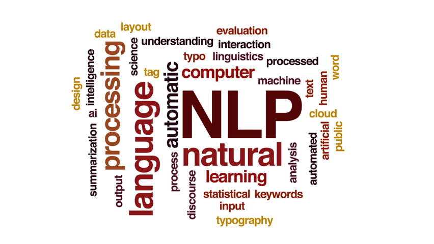
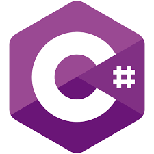
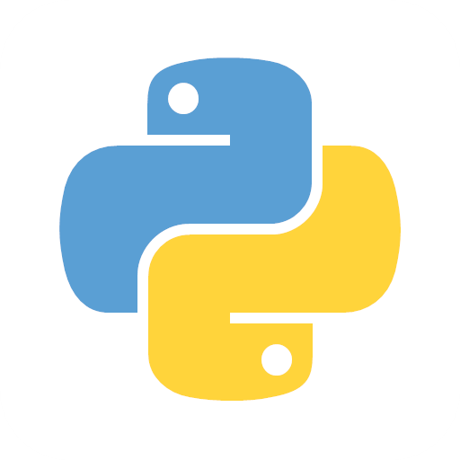
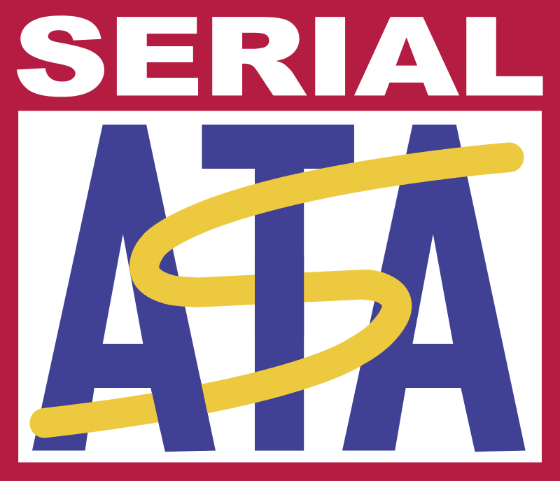

# MoonLight314

 
 

## 1. About Me
  * Name : Yi Chang Sic(이창식)
  * Nationality , City : South Korea , Seoul
  * I'm currently working as SW developer on HLDS(Hitachi-LG Data Storage)

 
 

## 2. Skills

  
  
  
  
  
  
  
  
  
  
  
  
  
  
  
  
  
  
  
  
  
  

- **Machine Learning**
- **Deep Learning**
- **Natural Language Processing**
- **Computer Vision**
- **SW Development**
- **Data Analysis**
- **Technical Support**
- **Data Structure / Algorithms**
- **Information / Network Security**
- **Embedded Software**
- **C / C++**
- **Java**
- **C#**
- **Android**
- **Python**
- **Digital Storage Device**
- **Network Programming**
- **Win32 API**
- **MFC**
- **SATA Protocol**
- **ATA/ATAPI Command Protocol**

 

## 3. Interests
- Deep Learning
- Computer Vision
- Natural Language Processing
- Machine Learning
- Kaggle
- Gunpla
- Algorithm

 

## 4. Certifications
* [Google Tensorflow Certificate](https://www.credential.net/bee24a43-10ea-40aa-b0ed-bbcab569944d)
* [Improving Deep Neural Networks: Hyperparameter Tuning, Regularization and Optimization](https://www.coursera.org/account/accomplishments/certificate/FSXGNWANCR4D)
* [Applied Machine Learning in Python](https://www.coursera.org/account/accomplishments/verify/6BTATF274DP5)
* [Machine Learning Foundations: A Case Study Approach](https://www.coursera.org/account/accomplishments/verify/82LUQAPU528R)

 

## 5. Tech. Review
- [Age / Gender Detection](https://moonlight314.github.io/deep/learning/Age_Gender_Detection/)
- [Mask Detection](https://moonlight314.github.io/deep/learning/Mask_Detection/)
- [Hand Gesture Detection - Rev #03](https://moonlight314.github.io/deep/learning/Hand_Gesture_Detection_Rev_03/)
- [Hand Gesture Detection - Rev #02](https://moonlight314.github.io/deep/learning/Hand_Gesture_Detection_Rev_02/)
- [Hand Gesture Detection - Rev #01](https://moonlight314.github.io/deep/learning/Hand_Gesture_Detection_Rev_01/)
- [The Strategy of Transfer Learning & Fine Tunung](https://moonlight314.github.io/deep/learning/Transfer_Learning_Fine_Tuning/)
- [Tensorflow Certificate](https://moonlight314.github.io/deep/learning/Tensorflow_Certificate/)
- [All About LSTM](https://moonlight314.github.io/deep/learning/All_About_LSTM_KR/)
- [BERT Text Classification](https://moonlight314.github.io/deep/learning/BERT_Text_Classification_EN/)
- [DCGAN Example](https://moonlight314.github.io/deep/learning/DCGAN_Example_EN/)
- [Batch Normalization](https://moonlight314.github.io/deep/learning/Batch_Normalization_EN/)
- [DCGAN(Deep Convolutional Generative Adversarial Networks)Permalink](https://moonlight314.github.io/deep/learning/DCGAN_Paper_Review_EN/)
- [GAN(Generative Adversarial Nets)](https://moonlight314.github.io/deep/learning/GAN_Paper_Review_EN/)
- [Using TFReocrd File](https://moonlight314.github.io/deep/learning/Using_TFRecord_EN/)
- [Making TFReocrd File](https://moonlight314.github.io/deep/learning/Making_TFRecord_EN/)
- [Tensorflow Input Pipeline](https://moonlight314.github.io/deep/learning/Tensorflow_Input_Pipeline_EN/)
- [Tensorflow 2.3 Installation on Windows 10](https://moonlight314.github.io/deep/learning/Win10_Tensorflow_2_GPU_EN/)
- [Kaggle Competition - Rainforest Connection Species Audio Detection - Revision #02](https://moonlight314.github.io/kaggle/Kaggle_RFCX_-2/)
- [Custom Generator](https://moonlight314.github.io/deeplearning/Custom_Generator/)
- [Kaggle Competition - Rainforest Connection Species Audio Detection #1](https://moonlight314.github.io/kaggle/Kaggle_RFCX_-1/)
- [Extractive Text Summarizers with BERT , GPT2 , XLNet](https://moonlight314.github.io/deeplearning/BERT_GPT2_XLNet/)
- [Gensim Text Summarizer](https://moonlight314.github.io/deeplearning/Gensim_Text_Summarizer/)
- [Attention Mechanism](https://moonlight314.github.io/deeplearning/Attention_Mechanism/)
- [Ubuntu에 GPU & Tensorflow 사용환경 설정](https://moonlight314.github.io/deeplearning/Ubuntu%EC%97%90-GPU-&-Tensorflow-%EC%82%AC%EC%9A%A9%ED%99%98%EA%B2%BD-%EC%84%A4%EC%A0%95/)
- [Sequence-to-Sequence Model](https://moonlight314.github.io/nlp/Seq2Seq_Model/)
- [NLP ( Natural Language Processing )](https://moonlight314.github.io/nlp/NLP/)
- [WSL ( Windows Subsystem for Linux )](https://moonlight314.github.io/wsl/WSL/)
- [LSTM Exercise #01 - Airplane Passengers Prediction](https://moonlight314.github.io/deeplearning/lstm/LSTM_Ex_01/)
- [LSTM Exercise #00 - Alphabet Prediction](https://moonlight314.github.io/deeplearning/lstm/LSTM_Ex_00/)
- [LSTM(Long-Short Term Memory)](https://moonlight314.github.io/deeplearning/lstm/LSTM/)
- [RNN(Recurrent Neural Network)](https://moonlight314.github.io/deeplearning/rnn/RNN/)
- [Kaggle Competition Related COVID19](https://moonlight314.github.io/kaggle/covid19/COVID19_Kaggle/)
- [CNN( Convolutional Neural Network )](https://moonlight314.github.io/study/cnn/CNN/)
- [Dog & Cat Classification Exercise #01](https://moonlight314.github.io/study/cnn/exercise/DogCatClassification_01/)
- [Dog & Cat Classification Exercise #00](https://moonlight314.github.io/study/cnn/exercise/DogCatClassification_00/)
- [Image Captioning](https://moonlight314.github.io/project/imagecaption/ImageCaptioning/)
 

## 6. Book Review
* [비지니스 데이터 과학](https://moonlight314.github.io/deep/learning/Book_Review_Business_Data_Science/)
* [구글 BERT의 정석 ( Getting Started With Google BERT )](https://moonlight314.github.io/deep/learning/Book_Review_-Getting_Started_With_Google_BERT/)
* [구글 엔지니어는 이렇게 일한다 ( Software Engineering At Google )](https://moonlight314.github.io/deep/learning/Book_Review_Software_Engineering_At_Google/)
* [Machine Learning At Working - 머신러닝 실무 프로젝트(2판)](https://moonlight314.github.io/deep/learning/Book_Review_Machine_Learning_At_Working/)
* [Building Machine Learning Powered Applications](https://moonlight314.github.io/deep/learning/Book_Review_Building_Machine_Learning_Powered_Applications/)
* [비전 시스템을 위한 딥러닝(Deep Learning For Vision System)](https://moonlight314.github.io/deep/learning/Book_Review_Deep_Learning_For_Vision_System/)

 
 

## 7. Education
Bachelor's degree : **Kyungpook National University - School of Electronic and Electrical Engineering**

Master’s degree : **Sejong Cyber University - Information / Network Security**
- Paper : [DDoS Detecting Model of Cloud Computing Environment](http://www.riss.kr/search/detail/DetailView.do?p_mat_type=1a0202e37d52c72d&control_no=5df17676d0082897d18150b21a227875)

 
 

## 8. Contact
* E-Mail : <moonlight314@mensakorea.org>
* LinkedIn : https://www.linkedin.com/in/chang-sic-yi-936867a5/
* Git Blog : [**MoonLight's Blog**](https://moonlight314.github.io/)
