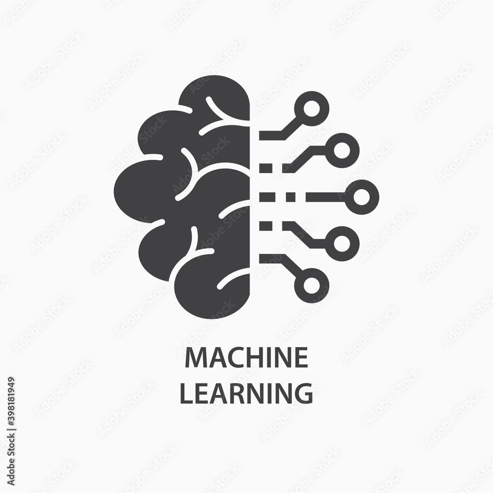

# MoonLight314

 
 

### 1. About Me

 

### 2. Skills
**Machine Learning**
Deep Learning
NLP
컴퓨터 비전
 
**소프트웨어 개발
 
Data Analysis
Debugging
기술지원
Algorithms
정보보안
Network Security
Embedded Software
C++
C
Java
C#
Android
임베디드 시스템
Python
Programming Skill
Digital Storage Device
Network Programming
Win32 API
MFC
SATA Protocol
ATA/ATAPI Command Protocol**

 

### 3. Interests

 

### 4. Cerificates
* [Google Tensorflow Certificate](https://www.credential.net/bee24a43-10ea-40aa-b0ed-bbcab569944d)
* [Improving Deep Neural Networks: Hyperparameter Tuning, Regularization and Optimization](https://www.coursera.org/account/accomplishments/certificate/FSXGNWANCR4D)
* [Applied Machine Learning in Python](https://www.coursera.org/account/accomplishments/verify/6BTATF274DP5)
* [Machine Learning Foundations: A Case Study Approach](https://www.coursera.org/account/accomplishments/verify/82LUQAPU528R)

 

### 5. Tech. Review

 

### 6. Book Review    
* [비전 시스템을 위한 딥러닝(Deep Learning For Vision System)](https://moonlight314.github.io/deep/learning/Book_Review_Deep_Learning_For_Vision_System/)
 
